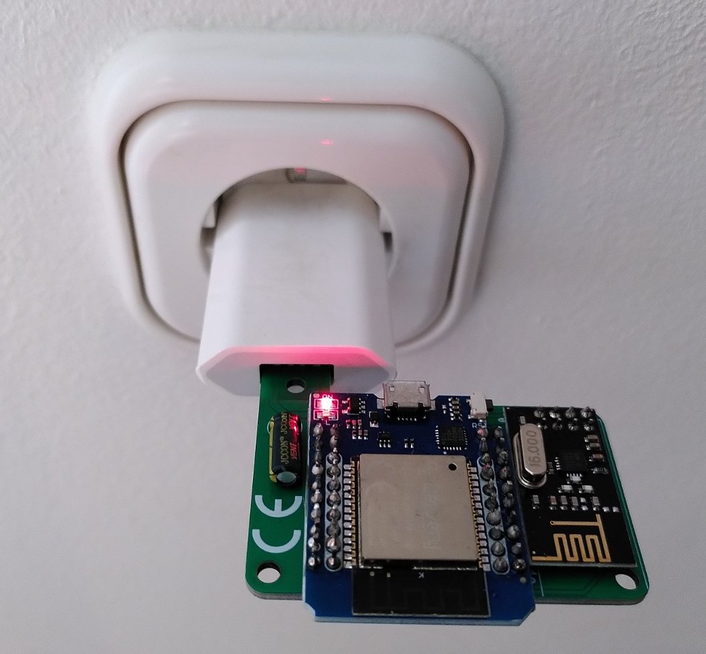
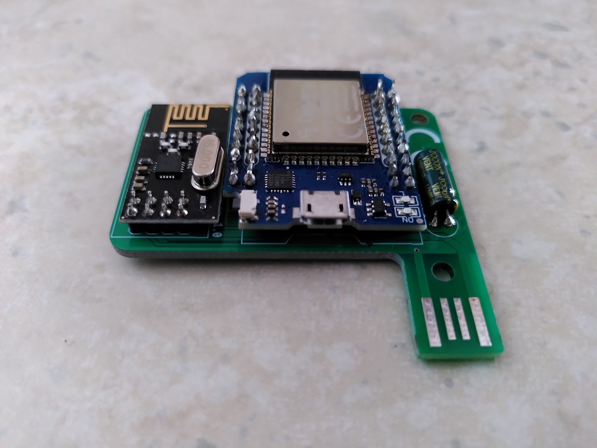

# USB-Gateway-Platine für z.B. OpenDTU auf ESP32-Basis
In diesem Repo werden die Unterlagen und Dateien zum USB-Gateway abgelegt.

Die Platine wurde mit Eagle entworfen und auf Basis des Schaltplans der Github-Page von OpenDTU (<https://github.com/tbnobody/OpenDTU>) erstellt.
Mit der besonderen Form der Platine kann das Gateway direkt über ein USB-Netzteil versorgt werden und benötigt daher kein Kabel oder eine zusätzliche Befestigung.

Wenn man die Platine fertigt gelötet hat und den ESP32 mit OpenDTU geflasht hat, müssen keine zusätzlichen Einstellungen bezüglich der GPIOs vorgenommen werden.
Die Pin-Belegung entspricht der Standardbelegung von OpenDTU.

**Benötigte Komponenten:**
- USB-Platine (siehe Dateien)
- ESP32 D1 MINI (<https://www.azdelivery.de/products/esp32-d1-mini>)
- NRF24L01 (<https://www.azdelivery.de/products/3x-nrf24l01-mit-2-4-ghz>)

Diese Repo hat nichts mit der OpenDTU-Repo (<https://github.com/tbnobody/OpenDTU>) zu tun und steht in keiner Absprache mit den Entwickler*innen. Danke für die tolle Arbeit der Community! Ich hoffe meine kleine Platine hilft euch!

Die Verwendung der gezeigten Platine bzw. des Schaltplanes erfolgt auf eigenes Risiko und ohne jegliche Gewährleistung!

Viel Spaß beim Modifizieren und Basteln! :)

